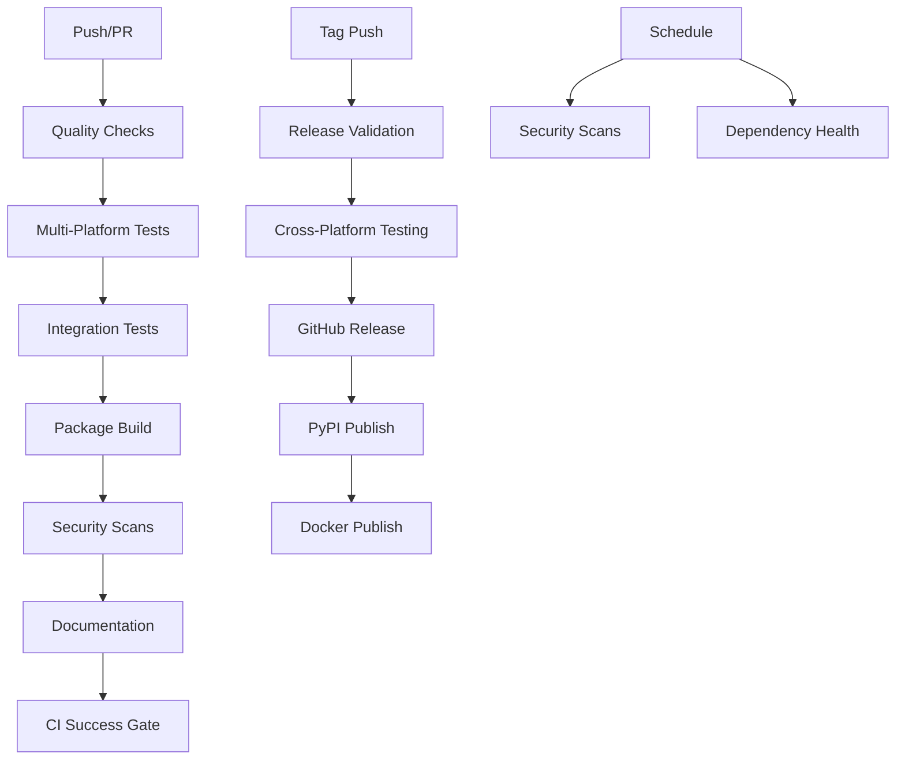

# CI/CD Implementation Guide

## Overview

This document outlines the comprehensive CI/CD implementation for the LLM Task Framework, based on industry best practices and inspired by enterprise-grade setups.

## Architecture

### Workflow Overview



## Implemented Workflows

### 1. Main CI Pipeline (`ci.yml`)

**Triggers:**
- Push to main/master/develop branches
- Pull requests
- Manual dispatch

**Jobs:**

#### Quality Checks
- Code formatting (Ruff)
- Type checking (MyPy)
- Security scanning (Bandit, Safety)
- **Timeout:** 10 minutes

#### Test Matrix
- **Platforms:** Ubuntu, Windows, macOS
- **Python versions:** 3.10, 3.11, 3.12
- **Coverage:** Codecov integration
- **LLM tests:** Conditional on API keys
- **Timeout:** 20 minutes per job

#### Integration Tests
- MCP server testing
- Integration test suite
- **Runs:** Only on non-draft PRs
- **Timeout:** 15 minutes

#### Package Build & Test
- Wheel/source distribution creation
- Package installation verification
- CLI functionality testing
- **Timeout:** 10 minutes

#### Performance Baseline
- Non-blocking performance tests
- Benchmark result storage
- **Status:** Continue on error
- **Timeout:** 15 minutes

#### Documentation
- Documentation build verification
- **Timeout:** 10 minutes

### 2. Security Pipeline (`security.yml`)

**Triggers:**
- Push/PR events
- Weekly scheduled scans
- Manual dispatch

**Security Layers:**

#### CodeQL Analysis
- GitHub's semantic analysis
- Security-extended queries
- SARIF report generation

#### Dependency Scanning
- Safety vulnerability checks
- pip-audit security analysis
- Bandit static analysis

#### Secret Detection
- detect-secrets baseline scanning
- Historical commit analysis

#### License Compliance
- License compatibility checking
- MIT license validation

#### Supply Chain Security
- Package integrity verification
- Build artifact analysis

### 3. Release Pipeline (`release.yml`)

**Triggers:**
- Tag push (v*)
- Manual dispatch with version input

**Release Stages:**

#### Pre-Release Validation
- Full test suite execution
- Security scan validation
- Version format verification

#### Multi-Platform Package Testing
- Cross-platform installation tests
- CLI functionality verification

#### Release Creation
- Automated changelog generation
- GitHub release creation
- Asset attachment

#### PyPI Publication
- Trusted publishing
- Package verification

#### Docker Image
- Multi-architecture builds (AMD64, ARM64)
- GitHub Container Registry publication

### 4. Dependency Management (`dependencies.yml`)

**Features:**
- Daily dependency health checks
- PR-triggered dependency analysis
- License compatibility verification
- Automated Dependabot integration

## Security Implementation

### Multi-Layer Security Strategy

1. **Static Analysis**
   - CodeQL semantic analysis
   - Bandit security linting
   - Safety vulnerability scanning

2. **Dependency Security**
   - Automated vulnerability detection
   - License compliance checking
   - Supply chain verification

3. **Secret Management**
   - Baseline secret detection
   - Pre-commit hook integration
   - Historical scanning

4. **Container Security**
   - Multi-stage builds
   - Non-root execution
   - Minimal attack surface

### Security Gates

```yaml
# Example security gate configuration
security_requirements:
  - codeql_analysis: required
  - dependency_scan: required
  - secret_detection: required
  - license_check: required
  - container_scan: required
```

## Quality Gates

### Coverage Requirements
- **Minimum:** 80% coverage
- **Target:** 85% project coverage
- **Patch:** 80% for new code
- **Reporting:** Codecov integration

### Code Quality Standards
- **Linting:** Ruff with comprehensive rules
- **Type checking:** MyPy strict mode
- **Security:** Zero high-severity vulnerabilities
- **Dependencies:** No known vulnerabilities

### Pre-commit Hooks
```yaml
hooks:
  - ruff-format
  - ruff-lint
  - mypy
  - bandit
  - detect-secrets
  - validate-pyproject
```

## Advanced CI/CD Features

### 1. Matrix Strategy Optimization

```yaml
strategy:
  fail-fast: false
  matrix:
    os: [ubuntu-latest, windows-latest, macos-latest]
    python-version: ["3.10", "3.11", "3.12"]
    exclude:
      # Optimize CI time by excluding some combinations
      - os: windows-latest
        python-version: "3.10"
```

### 2. Conditional Execution

```yaml
# Skip LLM tests without API keys
env:
  SKIP_LLM_TESTS: ${{ !secrets.ANTHROPIC_API_KEY && !secrets.OPENAI_API_KEY }}

# Run integration tests only on non-draft PRs
if: github.event.pull_request.draft == false
```

### 3. Artifact Management

```yaml
# Build artifacts with retention policies
- name: Upload build artifacts
  uses: actions/upload-artifact@v4
  with:
    name: dist-packages
    path: dist/
    retention-days: 30
```

### 4. Performance Monitoring

```yaml
# Non-blocking performance tests
continue-on-error: true
run: pytest --benchmark-only --benchmark-json=benchmark.json
```

## Best Practices Implemented

### 1. Fail-Fast Strategy
- Quick feedback on basic quality issues
- Expensive tests run only after basics pass

### 2. Resource Optimization
- Concurrent job execution
- Strategic matrix exclusions
- Appropriate timeouts

### 3. Security-First Approach
- Multiple security scanning layers
- Automated vulnerability detection
- Secure defaults everywhere

### 4. Developer Experience
- Clear error messages
- Comprehensive reporting
- Fast feedback loops

### 5. Production Readiness
- Multi-platform testing
- Package integrity verification
- Automated release processes

## Configuration Files

### Required Secrets
```yaml
secrets:
  CODECOV_TOKEN: # Coverage reporting
  PYPI_API_TOKEN: # Package publishing
  ANTHROPIC_API_KEY: # LLM testing (optional)
  OPENAI_API_KEY: # LLM testing (optional)
```

### Environment Configuration
```yaml
env:
  PYTHONPATH: src
  PYTHONUNBUFFERED: "1"
  FORCE_COLOR: "1"
```

## Monitoring and Alerting

### CI/CD Metrics
- Build success rates
- Test execution times
- Security scan results
- Dependency health

### Alerting Strategy
- Failed security scans → Immediate notification
- Coverage drops → Warning alerts
- Dependency vulnerabilities → Daily reports

## Integration Points

### External Services
- **Codecov:** Coverage reporting
- **GitHub Security:** Vulnerability management
- **PyPI:** Package distribution
- **GitHub Container Registry:** Docker images

### Development Tools
- **Pre-commit:** Local quality gates
- **Dependabot:** Dependency updates
- **CodeQL:** Security analysis

## Troubleshooting

### Common Issues

1. **Test Failures**
   - Check logs for specific error messages
   - Verify environment setup
   - Check for flaky tests

2. **Security Scan Failures**
   - Review security reports
   - Update vulnerable dependencies
   - Adjust security baselines if needed

3. **Build Failures**
   - Verify package configuration
   - Check dependency conflicts
   - Review build logs

### Debug Commands

```bash
# Local CI simulation
hatch run check  # Run all quality checks
hatch run test-cov  # Run tests with coverage
pre-commit run --all-files  # Run pre-commit hooks

# Security testing
bandit -r src/
safety check
detect-secrets scan --all-files
```

## Future Enhancements

### Planned Improvements
1. **Advanced Security**
   - SBOM (Software Bill of Materials) generation
   - Container vulnerability scanning
   - Runtime security monitoring

2. **Performance Optimization**
   - Parallel test execution
   - Caching strategies
   - Smart test selection

3. **Deployment Automation**
   - Blue-green deployments
   - Canary releases
   - Rollback automation

4. **Observability**
   - Enhanced metrics collection
   - Performance dashboards
   - Alert management

## Compliance and Standards

### Security Standards
- **OWASP Top 10:** Web application security
- **NIST Cybersecurity Framework:** Security controls
- **SLSA:** Supply chain security

### Quality Standards
- **ISO 25010:** Software quality model
- **IEEE 730:** Software quality assurance
- **Semantic Versioning:** Release management

---

This CI/CD implementation provides enterprise-grade quality, security, and reliability while maintaining developer productivity and fast feedback loops.
